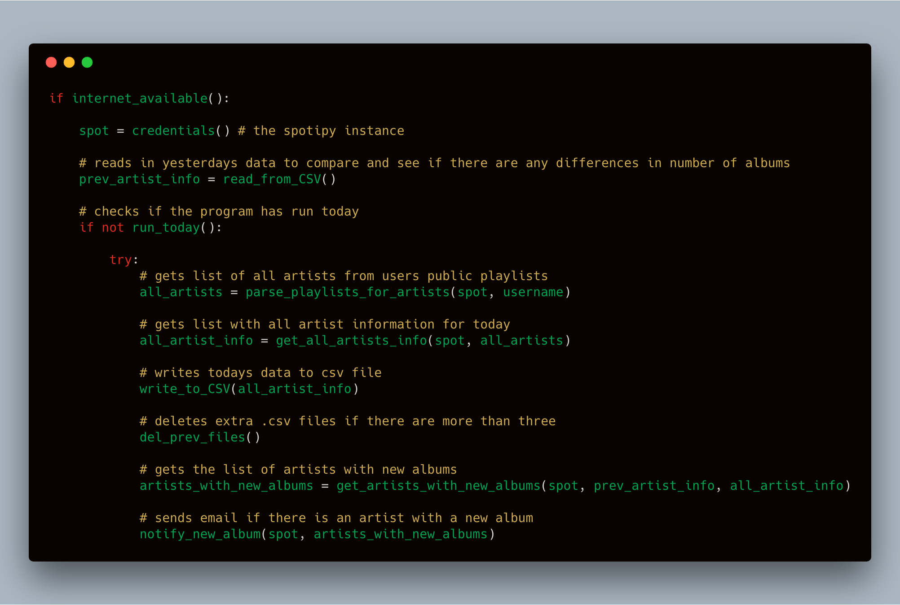

# Emailify

I got tired of missing out on new music. That's why I developed Emailify to notify me when there is new music released by my artists on Spotify.

The following program is an emailer which notifies you of any new music released by your Spotify artists. It works by parsing your public playlists and getting all your artists from there. Then daily it compares number of albums by all of the artists in those playlists. If it detects a change then the program automatically emails you with a link to the artists profile.

# Installation Instructions
1. Clone the repo
2. pip3 install progress (Progress bar animation)
3. pip3 install spotipy (Spotify python API)
4. Login or create a new Spotify developer account and create an application (https://beta.developer.spotify.com/dashboard/). You can call it whatever you want. Note down your application's client id and client secret.
5. Insert your spotify username in input.py
6. Insert your email addresses in input.py
7. Setup environment variables for client id ('spotify\_client\_id') and client secret ('spotify\_client\_secret') which can be found in the application you created on the Spotify developer portal in input.py
8. Type in email username in input.py to send emails from (I recommend creating a temporary email account to send emails from). Then setup email password as an environment variable ('email\_from\_pwd')
9. Run the program whenever you want ($ python3 spot.py) or create a crontab to run the program daily. The commands to create the crontab in command line on a Mac are shown below. Replace MINUTE, HOUR, and YOURFILEPATH with their respective values. Note that HOUR is in military/24 hour time

`$ crontab -e`

    MINUTE HOUR * * * cd YOURFILEPATH/Emailify/spot && YOURPATHTOPYTHON3/python3 spot.py

High level overview of how the program works

To Do
-----

* HTML format for email / Inline album artwork
* Add songs to new playlist that you can clear
* Get album id
* Tests
* Reduce api calls / threading
* Logging
* Better/more accurate search